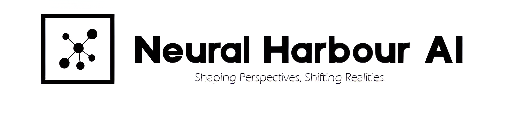

<!-- PROJECT LOGO -->
 

  

  <h3 align="center">LLM Based Holographic Assistant</h3>

  

    Shaping Perspectives Shifting Realities
     
     
    ·
    <a href="https://github.com/NeuralHarbour/LLM-Based-3D-Avatar-Assistant/issues">Report Bug</a>
    ·
    <a href="https://github.com/NeuralHarbour/LLM-Based-3D-Avatar-Assistant/issues">Request Feature</a>
  

  

<!-- TABLE OF CONTENTS -->

  
Table of Contents

  <ol>
    <li>
      <a href="#about-the-project">About The Project</a>
      <ul>
        <li><a href="#built-with">Built With</a></li>
      </ul>
    </li>
    <li>
      <a href="#getting-started">Getting Started</a>
      <ul>
        <li><a href="#prerequisites">Prerequisites</a></li>
        <li><a href="#installation">Installation</a></li>
      </ul>
    </li>
    <li><a href="#roadmap">Roadmap</a></li>
    <li><a href="#license">License</a></li>
    <li><a href="#acknowledgments">Acknowledgments</a></li>
  </ol>

<!-- ABOUT THE PROJECT -->
## About The Project

A virtual waifu / assistant that you can speak to through your mic and it'll speak back to you! Has many features such as:

* You can speak to her with a mic
* It can speak back to you
* It can recognize gestures and perform appropriate actions based on it
* Has dynamic voice controls
* Has short-term memory and long-term memory
* Can open apps
* Smarter than you
* Multilingual
* Can learn psychology
* Can recognize different people
* Can sing,dance do lot of other stuff.
* Can control your smart home like Alexa
* Dynamic animations

More features I'm planning to add soon in the [Roadmap](https://github.com/NeuralHarbour/LLM-Based-3D-Avatar-Assistant/v2.0#roadmap). Also, here's a summary of how it works for those of you who want to know:

First the speech which is obtained from the mic is first passed into the OpenAI Whisper model for detecting the language of the speech and then its passed on to the speech recognizer, 
the response is then sent to the client via a websocket, the transcribed text is then sent to gemini LLM, and the response from Jenna is printed to the unity console and appended to conversation_log.json, 
and finally, the response is spoken by our finedtuned Parler TTS.

Created Based on our publication
https://ieeexplore.ieee.org/document/10576146

(<a href="#readme-top">back to top</a>)

### Built With

* [Python](https://www.python.org)
* [Langchain 3.0](https://github.com/langchain-ai/langchain)
* [Whisper](https://openai.com/research/whisper)
* [SpeechRecognition](https://pypi.org/project/SpeechRecognition/)
* [PocketSphinx](https://pypi.org/project/pocketsphinx/)
* [Parler TTS](https://github.com/huggingface/parler-tts)
* [HyperDB](https://github.com/jdagdelen/hyperDB)
* [Sentence Transformers](https://github.com/UKPLab/sentence-transformers)
* [Tuya Cloud IoT](https://iot.tuya.com/)
* [Unity 2024](https://unity.com/)
* [Unity C#]
* Rust

(<a href="#readme-top">back to top</a>)

<!-- GETTING STARTED -->
## Getting Started

### Prerequisites

1. [Install Python 3.10.11](https://www.python.org/downloads/release/python-31011/) and set it as an environment variable in PATH
2. [Install GIT](https://git-scm.com/downloads)
3. [Install CUDA 11.7 if you have an Nvidia GPU](https://developer.nvidia.com/cuda-11-7-0-download-archive?target_os=Windows&target_arch=x86_64&target_version=10&target_type=exe_local)
4. [Install Visual Studio Community 2022](https://visualstudio.microsoft.com/thank-you-downloading-visual-studio/?sku=Community&channel=Release&version=VS2022&source=VSLandingPage&cid=2030&passive=false) and select `Desktop Development with C++` in the install options
5. [Install Unity]

## How to run

1.Create a new project in unity with URP Settings
 
 
2.Replace the assets folder with the one in this branch
 
 
3.Open the Unity Scene
 
 
4.Run the STT service using python STT.py
 
 
5.Launch the app by clicking on the play button
 
 
6.Say 'Start' to activate or 'Stop' to deactivate works like an OS

Compiled EXE version coming soon !!!

<!-- ROADMAP -->
## Roadmap

- [x] Long-term memory
- [x] Time and date awareness
- [ ] Virtual reality / augmented reality / mixed reality integration
- [x] Gatebox-style hologram
- [x] Dynamic Voice like GPT4o
- [ ] Animatronic body
- [x] Alexa-like smart home control
- [x] Multilingual
- [ ] Mobile version
- [x] Easier setup
- [ ] Compiling into one exe
- [x] Localized
- [ ] Home Control
- [ ] Outfit Change
- [ ] Add custom skills
- [ ] Music Player
- [ ] Different modes
- [ ] Face Recognition
- [ ] Dynamic Animations

(<a href="#readme-top">back to top</a>)

<!-- LICENSE -->
## License

Distributed under the GNU General Public License v3.0 License. See `LICENSE.txt` for more information.

(<a href="#readme-top">back to top</a>)

<!-- CONTACT -->
## Contact and Socials

E-mail: johnk4590@gmail.com
 
Project Link: [https://github.com/NeuralHarbour/LLM-Based-3D-Avatar-Assistant/v2.0](github.com/NeuralHarbour/LLM-Based-3D-Avatar-Assistant/v2.0)

(<a href="#readme-top">back to top</a>)

<!-- ACKNOWLEDGMENTS -->
## Acknowledgments

* [Choose an Open Source License](https://choosealicense.com)
* [AI Waifu Vtuber](https://github.com/ardha27/AI-Waifu-Vtuber)

(<a href="#readme-top">back to top</a>)

